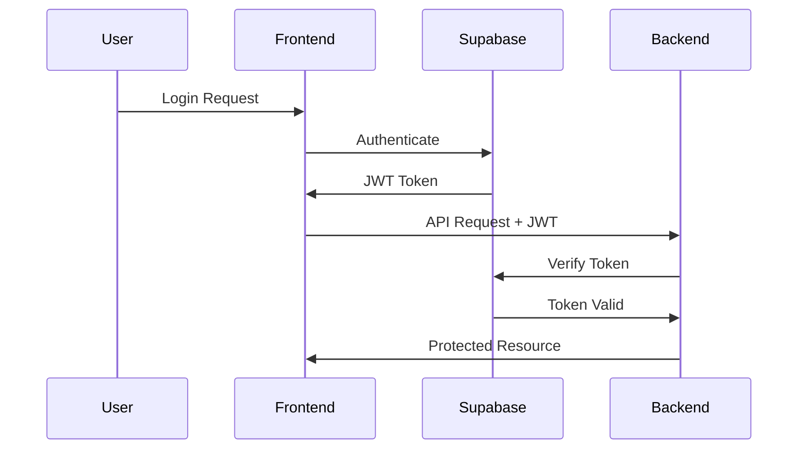

# Security Documentation

This document outlines the security measures, best practices, and guidelines implemented in the ScholarAI platform.

## Security Overview

ScholarAI implements a multi-layered security approach to protect user data, ensure exam integrity, and maintain system reliability.

### Security Principles

1. **Defense in Depth**: Multiple security layers at different levels
2. **Least Privilege**: Users and systems have minimal required permissions
3. **Zero Trust**: Verify every request regardless of source
4. **Data Protection**: Encryption at rest and in transit
5. **Privacy by Design**: Privacy considerations built into every feature

## Authentication & Authorization

### Authentication Flow



### JWT Token Security

```typescript
// Token validation middleware
export const authenticateToken = async (req: Request, res: Response, next: NextFunction) => {
  const authHeader = req.headers['authorization'];
  const token = authHeader && authHeader.split(' ')[1];

  if (!token) {
    return res.status(401).json({ error: 'Access token required' });
  }

  try {
    const { data: user, error } = await supabase.auth.getUser(token);
    
    if (error || !user) {
      return res.status(403).json({ error: 'Invalid token' });
    }

    req.user = user;
    next();
  } catch (error) {
    return res.status(403).json({ error: 'Token verification failed' });
  }
};
```

### Role-Based Access Control (RBAC)

```typescript
interface Permission {
  resource: string;
  action: 'create' | 'read' | 'update' | 'delete';
  conditions?: Record<string, any>;
}

const rolePermissions: Record<UserRole, Permission[]> = {
  teacher: [
    { resource: 'classroom', action: 'create' },
    { resource: 'classroom', action: 'read', conditions: { teacher_id: 'self' } },
    { resource: 'test', action: 'create' },
    { resource: 'analytics', action: 'read', conditions: { scope: 'own_classes' } }
  ],
  student: [
    { resource: 'test', action: 'read', conditions: { enrolled: true } },
    { resource: 'submission', action: 'create', conditions: { own: true } }
  ]
};

// Authorization middleware
export const authorize = (requiredPermission: Permission) => {
  return (req: Request, res: Response, next: NextFunction) => {
    const userRole = req.user.role;
    const permissions = rolePermissions[userRole];
    
    const hasPermission = permissions.some(permission => 
      permission.resource === requiredPermission.resource &&
      permission.action === requiredPermission.action &&
      checkConditions(permission.conditions, req)
    );

    if (!hasPermission) {
      return res.status(403).json({ error: 'Insufficient permissions' });
    }

    next();
  };
};
```

## Data Protection

### Encryption

#### Data at Rest
- **Database**: AES-256 encryption via Supabase
- **File Storage**: Server-side encryption with customer-managed keys
- **Backups**: Encrypted with separate key rotation

#### Data in Transit
- **HTTPS**: TLS 1.3 for all communications
- **API Calls**: Certificate pinning for mobile apps
- **WebSocket**: WSS (WebSocket Secure) for real-time features

```typescript
// HTTPS enforcement middleware
export const enforceHTTPS = (req: Request, res: Response, next: NextFunction) => {
  if (process.env.NODE_ENV === 'production' && !req.secure) {
    return res.redirect(301, `https://${req.headers.host}${req.url}`);
  }
  next();
};

// Security headers
export const securityHeaders = (req: Request, res: Response, next: NextFunction) => {
  res.setHeader('X-Frame-Options', 'DENY');
  res.setHeader('X-XSS-Protection', '1; mode=block');
  res.setHeader('X-Content-Type-Options', 'nosniff');
  res.setHeader('Referrer-Policy', 'strict-origin-when-cross-origin');
  res.setHeader('Permissions-Policy', 'camera=(), microphone=(), geolocation=()');
  res.setHeader('Strict-Transport-Security', 'max-age=31536000; includeSubDomains');
  
  next();
};
```

### Personal Data Protection

```typescript
// Data anonymization for analytics
export const anonymizeUserData = (userData: UserData): AnonymizedData => {
  return {
    id: hashUserId(userData.id),
    role: userData.role,
    createdAt: userData.createdAt,
    // Remove PII
    email: undefined,
    name: undefined,
    // Aggregate behavioral data only
    activityMetrics: userData.activityMetrics
  };
};

// Data retention policy
export const cleanupExpiredData = async () => {
  const retentionPeriod = 7 * 365 * 24 * 60 * 60 * 1000; // 7 years
  const cutoffDate = new Date(Date.now() - retentionPeriod);
  
  // Archive old test submissions
  await supabase
    .from('test_submissions')
    .delete()
    .lt('created_at', cutoffDate.toISOString());
    
  // Anonymize old user data
  await supabase
    .from('users')
    .update({ 
      email: 'anonymized@example.com',
      profile: {} 
    })
    .lt('last_login', cutoffDate.toISOString());
};
```

## Input Validation & Sanitization

### Frontend Validation

```typescript
import { z } from 'zod';
import DOMPurify from 'dompurify';

// Schema validation
const createTestSchema = z.object({
  title: z.string().min(1).max(200),
  description: z.string().max(1000).optional(),
  questions: z.array(z.object({
    type: z.enum(['multiple-choice', 'short-answer', 'essay']),
    question: z.string().min(1).max(500),
    options: z.array(z.string()).optional(),
    points: z.number().min(0).max(100)
  })).min(1).max(50)
});

// Input sanitization
export const sanitizeInput = (input: string): string => {
  return DOMPurify.sanitize(input, {
    ALLOWED_TAGS: ['b', 'i', 'em', 'strong', 'p', 'br'],
    ALLOWED_ATTR: []
  });
};

// Form validation hook
export const useValidatedForm = <T>(schema: z.ZodSchema<T>) => {
  const form = useForm<T>({
    resolver: zodResolver(schema)
  });

  const sanitizedSubmit = form.handleSubmit((data) => {
    // Sanitize string fields
    const sanitizedData = Object.fromEntries(
      Object.entries(data).map(([key, value]) => [
        key,
        typeof value === 'string' ? sanitizeInput(value) : value
      ])
    );
    
    return sanitizedData as T;
  });

  return { ...form, handleSubmit: sanitizedSubmit };
};
```

### Backend Validation

```typescript
import { body, param, validationResult } from 'express-validator';

// Validation middleware
export const validateRequest = (req: Request, res: Response, next: NextFunction) => {
  const errors = validationResult(req);
  if (!errors.isEmpty()) {
    return res.status(400).json({
      error: 'Validation failed',
      details: errors.array()
    });
  }
  next();
};

// Route validation
app.post('/api/tests',
  authenticateToken,
  authorize({ resource: 'test', action: 'create' }),
  [
    body('title').isLength({ min: 1, max: 200 }).escape(),
    body('description').optional().isLength({ max: 1000 }).escape(),
    body('questions').isArray({ min: 1, max: 50 }),
    body('questions.*.type').isIn(['multiple-choice', 'short-answer', 'essay']),
    body('questions.*.question').isLength({ min: 1, max: 500 }).escape(),
    body('questions.*.points').isFloat({ min: 0, max: 100 })
  ],
  validateRequest,
  createTest
);
```

## AI Proctoring Security

### Privacy Protection

```python
class PrivacyProtectedProctoring:
    def __init__(self):
        self.face_detector = FaceDetector()
        self.anonymizer = FaceAnonymizer()
        
    def process_frame(self, frame: np.ndarray) -> Dict[str, Any]:
        """Process frame while protecting privacy."""
        # Detect violations without storing raw video
        violations = self.detect_violations(frame)
        
        # Generate anonymized frame for logging
        anonymized_frame = self.anonymizer.anonymize_faces(frame)
        
        # Store only violation metadata, not raw video
        return {
            'violations': violations,
            'timestamp': time.time(),
            'frame_hash': self.hash_frame(anonymized_frame),
            # Do not store raw frame data
        }
    
    def hash_frame(self, frame: np.ndarray) -> str:
        """Generate frame hash for integrity verification."""
        frame_bytes = cv2.imencode('.jpg', frame)[1].tobytes()
        return hashlib.sha256(frame_bytes).hexdigest()
```

### Secure Data Transmission

```python
import ssl
import websocket
from cryptography.fernet import Fernet

class SecureProctoringClient:
    def __init__(self, server_url: str, encryption_key: bytes):
        self.server_url = server_url
        self.cipher = Fernet(encryption_key)
        self.ws = None
        
    def connect(self):
        """Establish secure WebSocket connection."""
        ssl_context = ssl.create_default_context()
        ssl_context.check_hostname = True
        ssl_context.verify_mode = ssl.CERT_REQUIRED
        
        self.ws = websocket.WebSocket(sslopt={"context": ssl_context})
        self.ws.connect(self.server_url)
        
    def send_violation_data(self, violation_data: Dict[str, Any]):
        """Send encrypted violation data."""
        # Encrypt sensitive data
        encrypted_data = self.cipher.encrypt(
            json.dumps(violation_data).encode()
        )
        
        # Send with integrity check
        message = {
            'type': 'violation',
            'data': encrypted_data.decode(),
            'checksum': hashlib.sha256(encrypted_data).hexdigest()
        }
        
        self.ws.send(json.dumps(message))
```

## API Security

### Rate Limiting

```typescript
import rateLimit from 'express-rate-limit';
import RedisStore from 'rate-limit-redis';
import Redis from 'ioredis';

const redis = new Redis(process.env.REDIS_URL);

// General API rate limiting
const apiLimiter = rateLimit({
  store: new RedisStore({
    sendCommand: (...args: string[]) => redis.call(...args),
  }),
  windowMs: 15 * 60 * 1000, // 15 minutes
  max: 100, // Limit each IP to 100 requests per windowMs
  message: 'Too many requests from this IP',
  standardHeaders: true,
  legacyHeaders: false,
});

// Strict rate limiting for authentication endpoints
const authLimiter = rateLimit({
  store: new RedisStore({
    sendCommand: (...args: string[]) => redis.call(...args),
  }),
  windowMs: 15 * 60 * 1000,
  max: 5, // Limit each IP to 5 auth requests per windowMs
  skipSuccessfulRequests: true,
});

// Apply rate limiting
app.use('/api/', apiLimiter);
app.use('/api/auth/', authLimiter);
```

### CORS Configuration

```typescript
import cors from 'cors';

const corsOptions = {
  origin: (origin: string | undefined, callback: Function) => {
    const allowedOrigins = [
      'https://ScholarAI.com',
      'https://app.ScholarAI.com',
      ...(process.env.NODE_ENV === 'development' ? ['http://localhost:5173'] : [])
    ];
    
    if (!origin || allowedOrigins.includes(origin)) {
      callback(null, true);
    } else {
      callback(new Error('Not allowed by CORS'));
    }
  },
  credentials: true,
  optionsSuccessStatus: 200,
  methods: ['GET', 'POST', 'PUT', 'DELETE', 'OPTIONS'],
  allowedHeaders: ['Content-Type', 'Authorization', 'X-Requested-With']
};

app.use(cors(corsOptions));
```

### SQL Injection Prevention

```typescript
// Use parameterized queries with Supabase
const getUserTests = async (userId: string, classroomId: string) => {
  // Safe: Uses parameterized query
  const { data, error } = await supabase
    .from('tests')
    .select('*')
    .eq('classroom_id', classroomId)
    .in('id', 
      supabase
        .from('test_submissions')
        .select('test_id')
        .eq('student_id', userId)
    );
    
  return data;
};

// For raw SQL (if needed), use prepared statements
const rawQuery = async (query: string, params: any[]) => {
  const { data, error } = await supabase.rpc('execute_query', {
    query_text: query,
    query_params: params
  });
  
  if (error) throw error;
  return data;
};
```

## Content Security Policy (CSP)

```typescript
// CSP configuration
const cspDirectives = {
  defaultSrc: ["'self'"],
  scriptSrc: [
    "'self'",
    "'unsafe-inline'", // Required for Vite in development
    "https://cdn.jsdelivr.net",
    "https://unpkg.com"
  ],
  styleSrc: [
    "'self'",
    "'unsafe-inline'",
    "https://fonts.googleapis.com"
  ],
  fontSrc: [
    "'self'",
    "https://fonts.gstatic.com"
  ],
  imgSrc: [
    "'self'",
    "data:",
    "https:",
    "blob:"
  ],
  mediaSrc: [
    "'self'",
    "blob:"
  ],
  connectSrc: [
    "'self'",
    "https://api.supabase.co",
    "https://*.firebase.com",
    "wss://realtime.supabase.co"
  ],
  frameSrc: ["'none'"],
  objectSrc: ["'none'"],
  baseUri: ["'self'"],
  formAction: ["'self'"],
  upgradeInsecureRequests: process.env.NODE_ENV === 'production' ? [] : undefined
};

// Apply CSP
app.use((req, res, next) => {
  const csp = Object.entries(cspDirectives)
    .filter(([_, value]) => value !== undefined)
    .map(([key, value]) => {
      const directive = key.replace(/([A-Z])/g, '-$1').toLowerCase();
      return `${directive} ${Array.isArray(value) ? value.join(' ') : value}`;
    })
    .join('; ');
    
  res.setHeader('Content-Security-Policy', csp);
  next();
});
```

## Monitoring & Incident Response

### Security Monitoring

```typescript
// Security event logging
export const logSecurityEvent = async (event: SecurityEvent) => {
  const logEntry = {
    timestamp: new Date().toISOString(),
    type: event.type,
    severity: event.severity,
    userId: event.userId,
    ip: event.ip,
    userAgent: event.userAgent,
    details: event.details,
    resolved: false
  };
  
  // Log to security monitoring system
  await supabase.from('security_logs').insert(logEntry);
  
  // Alert on high severity events
  if (event.severity === 'high') {
    await sendSecurityAlert(logEntry);
  }
};

// Suspicious activity detection
export const detectSuspiciousActivity = (req: Request, res: Response, next: NextFunction) => {
  const suspiciousPatterns = [
    /(\bor\b|\band\b).*?=.*?['"]/, // SQL injection patterns
    /<script[^>]*>.*?<\/script>/i, // XSS patterns
    /\.\.\//, // Path traversal
    /\bexec\b|\beval\b|\bsystem\b/i // Code injection
  ];
  
  const requestData = JSON.stringify({
    url: req.url,
    body: req.body,
    query: req.query,
    headers: req.headers
  });
  
  const isSuspicious = suspiciousPatterns.some(pattern => 
    pattern.test(requestData)
  );
  
  if (isSuspicious) {
    logSecurityEvent({
      type: 'suspicious_request',
      severity: 'medium',
      userId: req.user?.id,
      ip: req.ip,
      userAgent: req.get('User-Agent'),
      details: { url: req.url, method: req.method }
    });
  }
  
  next();
};
```

### Incident Response

```typescript
interface SecurityIncident {
  id: string;
  type: 'data_breach' | 'unauthorized_access' | 'system_compromise';
  severity: 'low' | 'medium' | 'high' | 'critical';
  description: string;
  affectedUsers: string[];
  containmentActions: string[];
  status: 'detected' | 'investigating' | 'contained' | 'resolved';
}

export class IncidentResponseManager {
  async handleIncident(incident: SecurityIncident) {
    // 1. Immediate containment
    if (incident.severity === 'critical') {
      await this.emergencyContainment(incident);
    }
    
    // 2. Notification
    await this.notifySecurityTeam(incident);
    
    // 3. User notification (if required)
    if (incident.affectedUsers.length > 0) {
      await this.notifyAffectedUsers(incident);
    }
    
    // 4. Documentation
    await this.documentIncident(incident);
  }
  
  private async emergencyContainment(incident: SecurityIncident) {
    // Disable affected accounts
    for (const userId of incident.affectedUsers) {
      await this.disableUser(userId);
    }
    
    // Revoke all active sessions
    await this.revokeAllSessions();
    
    // Enable enhanced monitoring
    await this.enableEnhancedMonitoring();
  }
}
```

## Compliance & Auditing

### GDPR Compliance

```typescript
// Data subject rights implementation
export class GDPRCompliance {
  async handleDataSubjectRequest(request: DataSubjectRequest) {
    switch (request.type) {
      case 'access':
        return await this.exportUserData(request.userId);
      case 'rectification':
        return await this.updateUserData(request.userId, request.updates);
      case 'erasure':
        return await this.deleteUserData(request.userId);
      case 'portability':
        return await this.exportPortableData(request.userId);
      case 'restriction':
        return await this.restrictProcessing(request.userId);
    }
  }
  
  private async exportUserData(userId: string) {
    const userData = await supabase
      .from('users')
      .select('*')
      .eq('id', userId)
      .single();
      
    const submissions = await supabase
      .from('test_submissions')
      .select('*')
      .eq('student_id', userId);
      
    return {
      personal_data: userData.data,
      test_submissions: submissions.data,
      export_date: new Date().toISOString()
    };
  }
  
  private async deleteUserData(userId: string) {
    // Anonymize instead of delete to maintain data integrity
    await supabase
      .from('users')
      .update({
        email: 'deleted@example.com',
        profile: {},
        deleted_at: new Date().toISOString()
      })
      .eq('id', userId);
  }
}
```

### Audit Logging

```typescript
// Comprehensive audit trail
export const auditLog = async (action: AuditAction) => {
  const auditEntry = {
    timestamp: new Date().toISOString(),
    userId: action.userId,
    action: action.type,
    resource: action.resource,
    resourceId: action.resourceId,
    changes: action.changes,
    ip: action.ip,
    userAgent: action.userAgent,
    sessionId: action.sessionId
  };
  
  await supabase.from('audit_logs').insert(auditEntry);
};

// Audit middleware
export const auditMiddleware = (action: string) => {
  return (req: Request, res: Response, next: NextFunction) => {
    const originalSend = res.send;
    
    res.send = function(data) {
      // Log successful actions
      if (res.statusCode < 400) {
        auditLog({
          userId: req.user?.id,
          type: action,
          resource: req.route?.path,
          resourceId: req.params.id,
          ip: req.ip,
          userAgent: req.get('User-Agent'),
          sessionId: req.sessionID
        });
      }
      
      return originalSend.call(this, data);
    };
    
    next();
  };
};
```

## Security Testing

### Automated Security Testing

```typescript
// Security test suite
describe('Security Tests', () => {
  describe('Authentication', () => {
    it('should reject requests without valid JWT', async () => {
      const response = await request(app)
        .get('/api/protected-route')
        .expect(401);
    });
    
    it('should reject expired tokens', async () => {
      const expiredToken = jwt.sign(
        { userId: 'test' },
        'secret',
        { expiresIn: '-1h' }
      );
      
      const response = await request(app)
        .get('/api/protected-route')
        .set('Authorization', `Bearer ${expiredToken}`)
        .expect(403);
    });
  });
  
  describe('Input Validation', () => {
    it('should sanitize XSS attempts', async () => {
      const maliciousInput = '<script>alert("xss")</script>';
      const response = await request(app)
        .post('/api/tests')
        .send({ title: maliciousInput })
        .expect(400);
    });
    
    it('should prevent SQL injection', async () => {
      const sqlInjection = "'; DROP TABLE users; --";
      const response = await request(app)
        .get(`/api/users/${sqlInjection}`)
        .expect(400);
    });
  });
});
```

## Security Best Practices

### Development Guidelines

1. **Never commit secrets**: Use environment variables
2. **Validate all inputs**: Client and server-side validation
3. **Use HTTPS everywhere**: No exceptions in production
4. **Implement proper error handling**: Don't leak sensitive information
5. **Keep dependencies updated**: Regular security updates
6. **Follow principle of least privilege**: Minimal required permissions
7. **Use secure coding practices**: OWASP guidelines

### Deployment Security

```bash
# Security checklist for deployment
# 1. Environment variables
echo "Checking environment variables..."
[ -z "$SUPABASE_SERVICE_ROLE_KEY" ] && echo "Missing SUPABASE_SERVICE_ROLE_KEY"

# 2. SSL/TLS configuration
echo "Checking SSL configuration..."
curl -I https://your-domain.com | grep -i "strict-transport-security"

# 3. Security headers
echo "Checking security headers..."
curl -I https://your-domain.com | grep -E "(X-Frame-Options|X-XSS-Protection|X-Content-Type-Options)"

# 4. Dependency vulnerabilities
echo "Checking for vulnerabilities..."
npm audit --audit-level high
```

---

Security is an ongoing process. Regular security reviews, penetration testing, and staying updated with the latest security practices are essential for maintaining a secure platform.
